## RAG痛点
### Index Process（文本向量化构建索引的过程）
#### MIssing Content(内容缺失): 原本的文本中就没有问题的答案 
#### 文档加载准确性和效率： 比如pdf文件的加载，如何提取其中的有用文字信息和图片信息等
#### 文档切分的粒度： 文本切分的大小和位置会影响后面检索出来的上下文完整性和与大模型交互的token数量，怎么控制好文档切分的度，是个难题。

### Query Process（检索增强回答的过程中）
#### Missed Top Ranked: 错过排名靠前的文档
#### Not in Context:  提取上下文与答案无关
#### Wrong Format(格式错误): 例如需要Json，给了字符串
#### Incomplete(答案不完整): 答案只回答了问题的一部分
#### Not Extracted(未提取到答案:) 提取的上下文中有答案，但大模型没有提取出来
#### Incorrect Specificity: 答案不够具体或过于具体

## RAG优化方案/思路
### 方向1:内容缺失
- 增加相应知识库：将相应的知识文本加入到向量知识库中。
- 数据清洗与增强：输入垃圾，那也必定输出垃圾。任何RAG工作流程想要获得优良表现，都必须先清洁数据。
- 更好的Prompt设计：通过Prompts，比如让大模型在找不到答案的情况下，输出“根据当前知识库，无法回答该问题”等提示。

### 方向2:文档加载准确性和效率
- 优化文档读取器：一般知识库中的文档格式都不尽相同，针对每一类文档，涉及一个专门的读取器。
- 数据清洗与增强

### 方向3:文档切分的粒度
- 内容重叠分块：为了保持文本块之间语义上下文的连贯性，在分块时，保持文本块之间有一定的内容重叠。
- 基于结构的分块：基于结构的分块方法利用文档的固有结构，如HTML或Markdown中的标题和段落，以保持内容的逻辑性和完整性。
- 基于递归的分块：重复的利用分块规则不断细分文本块。比如先通过段落换行符（\n\n）进行分割。然后，检查这些块的大小。如果大小不超过一定阈值，则该块被保留。对于大小超过标准的块，使用单换行符（\n）再次分割。以此类推，不断根据块大小更新更小的分块规则（如空格，句号）。
- 分块大小的选择：  
	不同的嵌入模型有其最佳输入大小。比如Openai的text-embedding-ada-002的模型在256 或 512大小的块上效果更好。  
	文档的类型和用户查询的长度及复杂性也是决定分块大小的重要因素。

### 方向4:错过排名靠前的文档
外挂知识库中存在回答问题所需的知识，但是可能这个知识块与问题的向量相似度排名并不是靠前的，导致无法召回该知识块传给大模型，导致大模型始终无法得到正确的答案。 
- 增加召回数量：增加召回的 topK 数量，也就是说，例如原来召回前3个知识块，修改为召回前5个知识块。不过此种方法，因为知识块多了，不光会增加token消耗，也会增加大模型回答问题的干扰。
- 重排（Reranking）

### 方向5:提取上下文与答案无关
-内容缺失 或 错过排名靠前的文档 的具体体现

### 方向6:格式错误
- Prompt调优优化Prompt逐渐让大模型返回正确的格式。
- 进行结果格式验证，例如使用LangChain中的PydanticOutputParser类来校验输出格式。
- Auto-Fixing自修复：对不符合要求的格式进行自动修复

### 方向7:答案不完整
- 将问题分开提问一方面引导用户精简问题，一次只提问一个问题。 另一方面，针对用户的问题进行内部拆分处理，拆分成数个子问题，等子问题答案都找到后，再总结起来回复给用户

### 方向8:未提取到答案
- 提升压缩技术

### 方向9:答案太具体或太笼统
- 提示词改善 或者 提升基座大模型能力

# Advanced RAG

Advanced RAG重点聚焦在检索增强，即优化Retrieval阶段。增加了Pre-Retrieval预检索和Post-Retrieval后检索阶段，同时对检索本身也有优化。

## 预检索过程优化/检索前优化

高级RAG着重优化了索引结构和查询的方式。优化索引旨在提高被索引内容的质量，包括增强数据颗粒度、优化索引结构、添加元数据、对齐优化等策略。查询优化的目标则是明确用户的原始问题，使其更适合检索任务，使用了查询重写、查询转换、查询扩展等技术。

## 检索优化

检索阶段的目标是*确定最相关的上下文*。通常，检索基于向量搜索，它计算查询与索引数据之间的语义相似性。因此，大多数检索优化技术都围绕嵌入模型展开，比如微调嵌入模型，将嵌入模型定制为特定领域的上下文，特别是对于术语不断演化或罕见的领域。

还有其他检索技术，例如混合搜索，通常是指将向量搜索与基于关键字的搜索相结合的概念。

## 后检索过程优化/检索后优化

对于由问题检索得到的一系列上下文，后检索策略关注如何优化它们与查询问题的集成。

这一过程主要包括重新排序和压缩上下文。重新排列检索到的信息，将最相关的内容予以定位标记，这种策略已经在LlamaIndex2、LangChain等框架中得以实施。

有时直接将所有相关文档输入到大型语言模型（LLMs）可能导致信息过载，为了缓解这一点，后检索工作集中选择必要的信息，强调关键部分，并限制了相应的上下文长度。

## Pre-Retrieval预检索优化

### 优化索引
1. ##### 摘要索引
2. ##### 父子索引
3. ##### 假设性问题索引
4. ##### 元数据索引

### 查询优化
1. ##### Enrich完善问题
2. ##### Multi-Query 多路召回
3. ##### Decomposition 问题分解

 

### 摘要索引

痛点分析
在处理大量文档时，如何快速准确地找到所需信息是一个常见挑战。
摘要索引可以用来处理*半结构化数据*，比如许多文档包含多种内容类型，包括文本和表格。
这种半结构化数据对于传统 RAG 来说可能具有挑战性，文本拆分可能会分解表，从而损坏检索中的数据；
嵌入表可能会给语义相似性搜索带来挑战。

基本思路：
\- 让LLM为每个块生成*summary*，并作为embedding存到summary database中
\- 在检索时，通过summary database找到最相关的summary，再回溯到原始文档中去
\- 将原始文本块作为上下文发送给LLM以获取答案

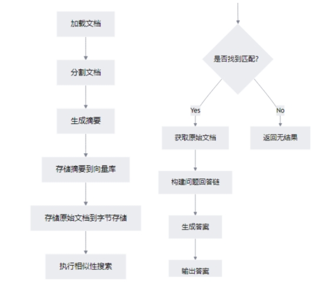 

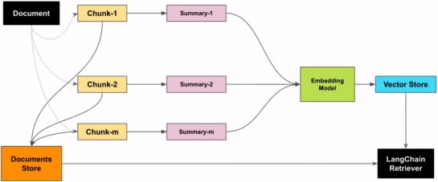 

 

### 父子索引

痛点分析
我们在利用大模型进行文档检索的时候，常常会有相互矛盾的需求，比如：
1. 你可能希望得到较小的文档块，以便它们Embedding以后能够最准确地反映出文档的含义，如果文档块太大，Embedding就失去了意义。
2. 你可能希望得到较大的文档块以保留较多的内容，然后将它们发送给LLM以便得到全面且正确的答案。

基本思路：
1. 文档被分割成一个层级化的块结构，随后用最小的叶子块进行索引
2. 在检索过程中检索出top k个叶子块
3. 如果存在n个叶子块都指向同一个更大的父块，那么我们就用这个父块来替换这些子块，并将其送入大模型用于生成答案。

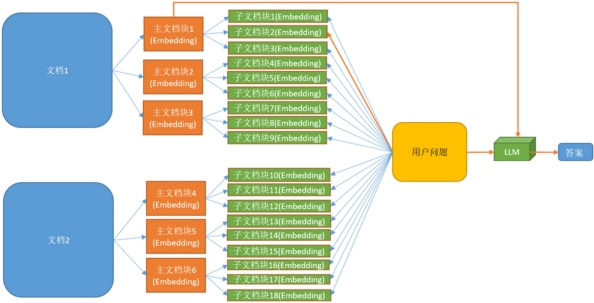 

 

### 假设性问题索引

假设性问题是一种提问方式，它基于一个或多个假设的情况或前提来提出问题。在对知识库中文档内容进行切片时，是可以以该切片为假设条件，利用LLM预先设置几个候选的相关性问题的，也就是说，这几个候选的相关性问题是和切片的内容强相关的。

基本思路：
1. 让LLM为每个块生成3个假设性问题，并将这些问题以向量形式嵌入数据库
2. 在运行时，针对这个问题向量的索引进行查询搜索（用问题向量替换文档的块向量）
3. 检索后将原始文本块作为上下文发送给LLM以获取答案

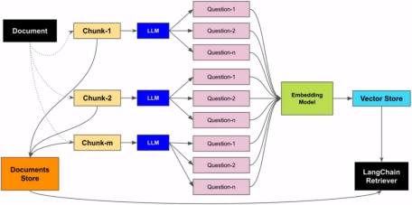 

 

### 元数据索引

痛点分析

在企业复杂的知识密集型应用中，可能会面临几百个不同来源与类型的知识文档。如果只是简单地依赖传统的文本分割与 top-k 检索，就会产生精度不足、知识相互干扰等问题，从而导致效果不佳。想象一下，你想在一个医学文献数据库中查找关于“糖尿病足”的资料，但数据库中也充斥着大量关于其他糖尿病并发症的信息。

一个重要的优化方法是在大文档集下“分层”过滤与检索。比如元数据索引

元数据是对文档的一种属性描述，假设我们使用一个存储了大量科技博客文章的向量数据库。每篇文章都关联了以下标签：

topic: 人工智能, 区块链, 云计算, 大数据  

author: 作者A, 作者B, 作者C  

year: 2022, 2023, 2024

基本思路：
1. 定义元数据标签，如果文档本身没有，可以利用大模型推理出输入问题的元数据
2. 通过标签先对文档进行过滤
3. 结合向量检索进一步定位到最相关的前 K 个知识块

LangChain 中使用SelfQueryRetriever自查询检索器实现

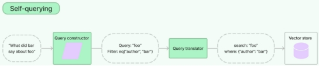 

 

| **索引优化**       | **适用场景**                                 | **案例**                                                     |
| ------------------ | -------------------------------------------- | ------------------------------------------------------------ |
| **摘要索引**       | 适用于需要快速检索和生成简洁上下文的场景。   | 在新闻资讯平台中，系统需要快速从海量新闻中提取关键信息，通过摘要索引可以迅速生成简洁的上下文，帮助用户快速了解新闻的核心内容。 |
| **父子索引**       | 适用于需要确保语义完整性和层次化检索的场景。 | 在法律检索系统中，用户查询法律条款时，父子索引通过分层检索精准查找相关内容，并召回对应大文档块确保上下文的完整性，避免因分块过细导致语义丢失。 |
| **假设性问题索引** | 适用于需要处理复杂查询和多样化表达的场景。   | 在药品咨询系统中，用户查询症状时可能会问：“感冒了吃什么药？”。假设性问题索引通过为每种药品生成一系列假设性问题，帮助用户更准确地检索到相关信息。 |
| **元数据索引**     | 适用于需要快速筛选和分类的场景。             | 在电商推荐系统中，系统通过元数据索引快速筛选出符合用户偏好的商品信息，提高推荐效率和准确性。 |

 

## 查询优化

### Enrich完善问题

痛点分析
我们希望实现让人们通过自然的口语对话来使用大模型应用。然而，在口语表达需求和意图时，人们往往会遇到一些问题。例如，表达过于简略或含糊，容易引发语义歧义，导致大模型产生误解；用户的问题可能包含许多隐含要素，但表达的信息却不足，只能通过多轮对话逐步补全；

理想情况：通过大模型多次主动与用户沟通，不断收集信息，完善对用户真实意图的理解，补全执行用户需求所需的各项参数。

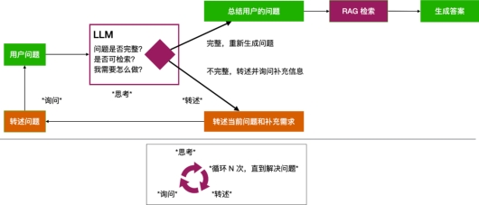 

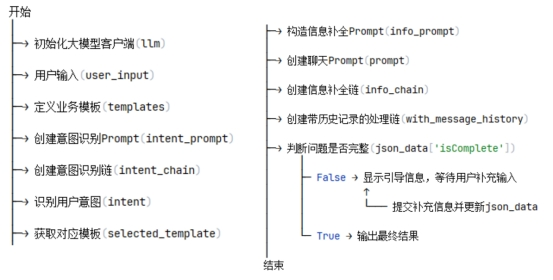 

### Multi-Query 多路召回

痛点分析
当用户没有正确书写查询语句，或者LLM不能够正确理解用户查询语句的含义时，此时LLM生成的答案可能就不够完整和全面。

当用户输入查询语句(自然语言)时，我们让大模型(LLM)基于用户的问题再生成多个查询语句，这些生成的查询语句是对用户查询语句的补充，它们是从不同的视角来补充用户的查询语句，然后每条查询语句都会从向量数据库中检索到一批相关文档，最后所有的相关文档都会被喂给LLM，这样LLM就会生成比较完整和全面的答案。这样就可以避免因为查询语句的差异而导致结果不正确
基本思路:
\- 利用 LLM 生成 N 个与原始查询相关的问题

\- 将所有问题（加上原始查询）发送给检索系统。

\- 通过这种方法，可以从向量库中检索到更多文档。

 

### Decomposition 问题分解

痛点分析
如果用户的问题很复杂，大模型需要推理分解多个步骤才能完成，但是大模型不具备推理能力怎么办？

可以用提示词工程中的CoT策略，把用户的问题拆成一个一个小问题来理解接下来可以使用并行与串行两个策略来执行子任务。

#### 并行执行
将每个子任务抛出去获得一个答案，然后再让大模型把所有子任务的答案汇总起来。

#### 串行
依次执行子任务，然后将前一个任务生成的答案作为后一个任务的提示词的一部分。

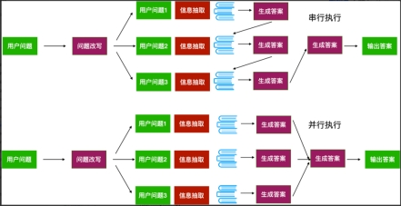 

 

查询优化：查询优化的目标是提升用户意图理解的准确性，包括：
1. Enrich完善问题：通过大模型引导完善用户问题，产生一个更利于系统理解的完善后的用户问题。
2. 多路召回（Multi-Query）针对用户问题生成多个相关问题，分别检索后汇总结果。
3. 问题分解（Decomposition）将复杂问题拆分为多个子问题，依次或同步解决所有子问题从而获取最终答案。

## 检索优化-混合检索

混合检索的*核心价值*：取长补短，动态适配混合检索的
本质是根据数据特性、查询需求和场景约束，动态组合多种检索技术：
*向量检索*擅长捕捉语义相似性，但可能受限于向量空间的表示能力；
*关键词/全文检索*适合精确匹配，但对自然语言表达不友好；

SQL检索利用数据库，却难以应对非结构化文本。
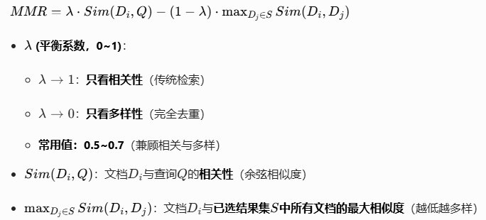

#### 适用场景
1. 动态知识与实时性需求：融合静态知识与实时数据
2. 高准确率与召回率要求：医疗、法律等关键领域
 
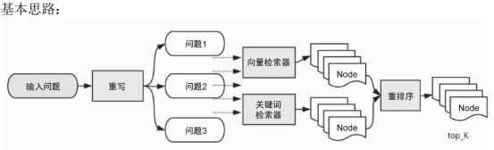 

 
## Post-Retrieval后检索优化

与检索前处理相对应，这是在完成检索后对检索出的相关知识块做必要补充处理的阶段。比如，对检索的结果借助更专业的排序模型与算法进行重排序或者过滤掉一些不符合条件的知识块等，使得最需要、最合规的知识块处于上下文的最前端，这有助于提高大模型的输出质量。

重排序

可以使用模型或者算法进行

RAG-Fusion

上下文压缩和过滤

 

### RAG-Fusion

#### 痛点分析
在多个查询检索后，会检索到大量的上下文，但并非所有上下文都与问题相关，有的不相关文档可能出现在文档前面，影响答案生成的准确性

#### 基本思路：
RAG-Fusion 是一种搜索方法，通过使用**多重查询生成和互惠排名融合**（Reciprocal Rank Fusion）对搜索结果进行重新排序。在Multi Query的基础上，对其检索结果进行重新排序(即reranking)后输出Top K个最相关文档，最后将这top k个文档喂给LLM并生成最终的答案

**Reciprocal Rank Fusion**（倒数排名融合，RRF）：
将多个不同检索的排名列表合并。

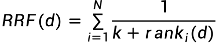 

N：参与融合的检索列表数量（例如BM25和向量检索，则N=2；multi−query生成了3个问题，则N=3
rank_i(d)：文档d在第i个检索系统从的排名（从1开始计数）
k：平滑常数，通常设置为60

 
### 上下文压缩和过滤

#### 痛点分析
我们划分文档块的时候，通常不知道用户的查询，这意味着，与查询最相关的信息可能隐藏在一个包含大量不相关文本的文档中，这样输入给LLM，可能会导致更昂贵的LLM调用和较差的响应。

#### 基本思路：
使用给定查询的上下文来压缩它们，以便只返回相关信息，而不是立即按原样返回检索到的文档

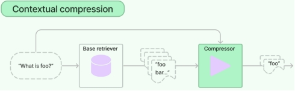

