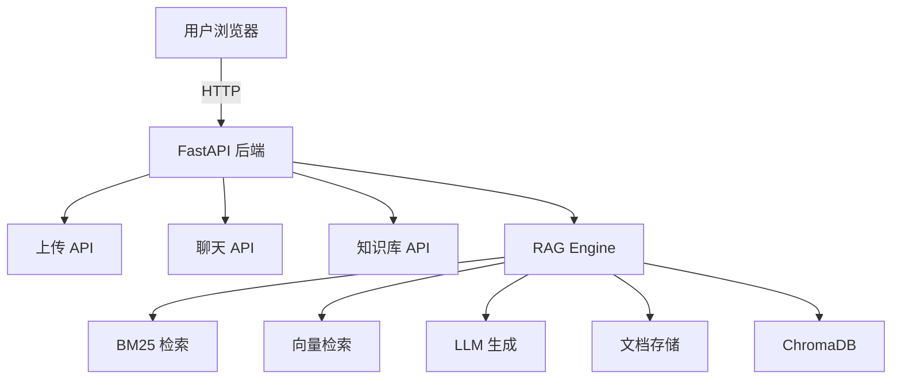

Rag_Project是一个可以用于上传文档并进行问答的基于python的fastapi的Web应用。使用了混合检索(bm25与向量检索)

## 目录结构
Rag_Project\
├── app.py                    # FastAPI 主程序
├── config.py                 # 配置文件
├── requirements.txt          # 依赖包
├── static/                   # 静态文件
│   ├── css/
│   │   └── style.css
│   └── js/
│       └── main.js
├── templates/                # HTML 模板
│   ├── base.html
│   ├── index.html
│   ├── upload.html
│   └── chat.html
├── knowledge_base/           # 知识库存储
│   ├── documents/            # 上传的文档
│   └── chroma_db/            # 向量数据库
└── rag_core/                 # RAG 核心模块
    ├── __init__.py
    ├── document_loader.py    # 文档加载
    ├── vector_store.py       # 向量存储
    └── rag_engine.py         # RAG 引擎

## 功能说明
| 页面 | 功能 |
| :------: | :------: |
| 主页 | 导航中心，显示知识库状态 |
| 上传页 | 多文件上传、拖拽上传、向量化存储 |
| 问答页 | 选择知识库、聊天对话、混合检索 |

## 项目结构图

## 名称转换示例
| 用户输入 | 内部集合名称 |
| :------: | :------: |
| 向量数据库对比 | kb_a1b2c3d4 |
| 医疗知识库 | kb_e5f6g7h8 |
| test_kb | test_kb |
| my-docs | my-docs |
| 123 | kb_123 |